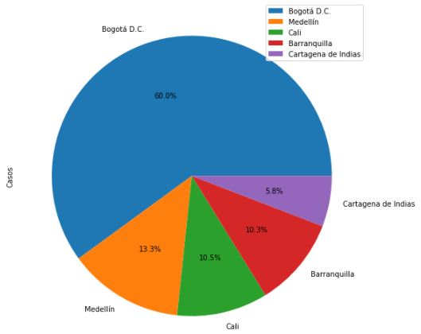
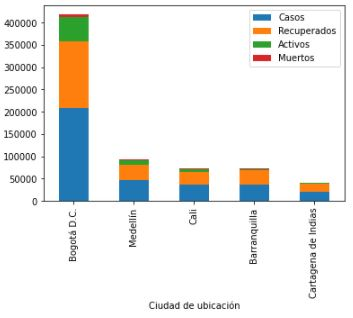
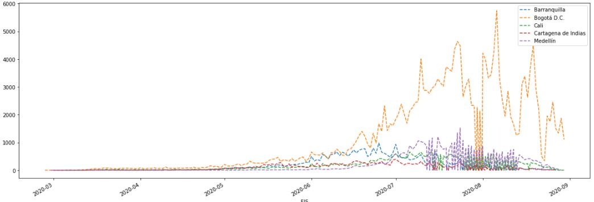

# Metodología usada en predicción de Covid-19 en Colombia

Para el desarrollo del proyecto de predicción de Covid-19 en las principales ciudades de Colombia se utilizó la metodología CRISP-DM (Cross-Industry Standard Process for Data Mining), la cual proporciona una descripción normalizada del ciclo de vida de un proyecto estándar de análisis de datos. Esta metodología contiene seis fases: 

1. Entendimiento del negocio
2. Entendimiento de los datos
3. Preparación de datos
4. Modelamiento
5. Evaluación
6. Desarrollo

La secuencia de las fases no es estricta. De hecho, la mayoría de los proyectos avanzan y retroceden entre fases en caso de ser necesario. 

  

# Entendimiento del negocio
En esta fase se busca conocer la necesidad del negocio, evaluar la situación actual y determinar el objetivo a resolver con el proyecto de minería de datos.

Coronavirus es el nombre que recibe una amplia familia de virus que pueden infectar al ser humano causando una variedad de enfermedades severas. Un miembro de la familia de coronavirus es el SARS-CoV-2 o mejor conocido como Covid-19, el cual se transmite y circula ampliamente entre la comunidad.

La enfermedad del Covid-19 fue reportada el 31 de diciembre de 2019 en la ciudad de Wuhan en China, esta enfermedad se exparció rápidamente por el mundo al punto que la organización mundial de la salud (OMS), declaró el 4 de mayo de 2020, el Covid-19 como pandemia, luego de que se registraran 3.581.884 confirmados al rededor del mundo, dejando a esa fecha 248.558 muertes.

Colombia no ha sido ajena a la pandemia. El primer caso positivo se registró el 6 de marzo de 2020 y el gobierno nacional el 24 de marzo declara ailamiento estricto para evitar la rápida propagación y así poder mitigar el impacto que ocasionaría la enfermedad en la red hospitalaria. 

### Objetivo del negocio

El objetivo del negocio es conocer el comportamiento del Covid-19 en las 5 principales ciudades de Colombia, a partir de los estados por los que pasa una persona desde que se reporta como infectada.

### Objetivo de minería de datos

El objetivo de este proyecto es la predicción de corto y mediano plazo del total de casos confirmados, nuevos casos, casos activos, recuperados y muertes para las 5 principales ciudades de Colombia, utilizando técnicas estadísticas, de inteligencia artificial o modelos híbridos.

#### Requerimientos

  * El producto de datos propuesto debe descargar la última información dispobile de forma automática cada vez que se ejecute.

  * La limpieza de datos, recalibración de los modelos, etc, deben ejecutarse automaticamente sin intervención humana. Es decir, el usuario ejecuta unicamente la rutina principal y todo el sistema se actualiza automaticamente.

  * Debe presentar los resultados en un dashboard que use GitHub pages (recuerde que puede utilizar jinja2, HTML, etc)

  * Debe presentar intervalos de confianza para los pronósticos.

  * Debe presentar métricas de calibración para la información histórica.

# Entendimiento de los datos

En esta fase se explora las fuentes de datos a utilizar para el desarrollo del proyecto, se describen los datos, se exploran y se verifica la calidad de los mismos.

El comportamiento del Covid-19 en las principales ciudades de Colombia esta siendo recolectado y centralizado por el Instituto Nacional de Salud. Esta información esta siendo puesta a disposición del público general, a través de la página web [www.datos.gov.co](https://www.datos.gov.co/Salud-y-Protecci-n-Social/Casos-positivos-de-COVID-19-en-Colombia/gt2j-8ykr/data)

### Diccionario de datos
|**Campo**                             |**Tipo de dato** |
|---------                             | --------------- |
|ID de caso.                           | Texto           | 
|Fecha de notificación	                | Texto           |
|Código DIVIPOLA                       | Texto           |
|Ciudad de ubicación                   | Texto           |
|Departamento o Distrito               | Texto           |
|atención                              | Texto           |
|Edad                                  | Texto           |
|Sexo                                  | Texto           |
|Tipo                                  | Texto           |
|Estado                                | Texto           |
|País de procedencia                   | Texto           |
|Fecha de inicio de síntomas (FIS)     | Texto           |
|Fecha de muerte                       | Texto           |
|Fecha diagnostico                     | Texto           |
|Fecha de confirmación por laboratorio | Texto           |
|Fecha recuperado                      | Texto           |
|Fecha reporte web                     | Texto           |
|Fecha de publicación en sitio web     | Texto           |
|Tipo recuperación                     | Texto           |
|Codigo departamento                   | Número          |
|Codigo pais                           | Número          |
|Pertenencia etnica                    | Texto           |
|Nombre grupo etnico                   | Texto           |

Se realizó un análisis exploratorio de los datos y el detalle se puede encontrar en el siguiente vínculo:
[Análisis descriptivo](docs/Análisis_descriptivo_Covid.ipynb)

### Análisis gráfico a corte de 30 de Agosto de 2020

#### Comparación entre las 5 ciudades con mas casos

#### Estados de la infección por ciudad

#### Evolución en el tiempo

#### Tabla comparativa

Nota: La columna ERR cuenta los registros que originalmente tenian fecha de recuperado y fecha de muerte simultaneamente.

### Hallazgos

1. La columna de atención en la cual se registran diferentes estados se encontró que hay problemas de calidad como registros que tienen fecha de recuperado o de muerto y no su correspondiente estado, o valores nulos por lo cual se tomó la decisión de utilizar las fechas de recuperado y de muerte para realizar los respectivos conteos.
2. Se evidencia que el campo de fecha de inicio de síntomas se está utilizando para marcar los casos de personas asintomáticas por lo cual es necesario hacer una limpieza para realizar los conteos de infecciones con dicho campo. 
3. Se encontró que existen registros con el campo de fecha de recuperado y fecha de muerte simultaneamente lo cual es una inconsistencia por lo cual se debe realizar un tratamiento.
4. Al validar los conteos de infectados, muertos, recuperados y activos de los ultimos dias reportados, encontramos que los últimos días siempre se registran valores atípicos que en días posteriores se actualizan por lo cual determinamos que lo mejor es descartar los ultimos 3 días de la serie para evitar que dichos datos preliminares generen ruido en las tendencias.

# Preparación de datos

En esta fase se toma como insumo los hallazgos encontrados en la fase anterior para ser ajustados de acuerdo a lo requerido, aquí se seleccionan los datos a usar dentro del proyecto, se aumenta la calidad de los mismos, en caso de ser necesario se construyen nuevos atributos y se integra diferentes fuentes de información

### Actividades realizadas

#### Datos seleccionados

#### Limpieza

#### Derivación de nuevos atributos

# Modelamiento

En la fase de modelamiento se evaluan las diferentes técnicas que de acuerdo a la literatura y conocimiento previo tengan una aproximación significativa a la solución del objetivo de mineria de datos. Se selecciona la técnica que más se ajusta, para luego construir el modelo y ejecutarlo.

### Técnicas utilizadas

### SIR (Suceptible - Infectado - Recuperado o Muerto)

#### Modelo lógistico

Función mantemática usada en diferentes modelos de crecimiento poblacional, propagación de enfermedades epidémicas. Se caracteriza por un crecimiento incremental al inicio y luego decrecer en un estado del tiempo, dicho crecimiento es carecterizado por la fórmula:

#### Redes Neuronales 

# Evaluación 

En esta etapa se revisa los resultados obtenidos en la ejecución del modelo, con el fin de evaluar las métricas de desempeño que arroja el modelo y determinar si este cumple con los objetivos propuestos.

# Despliegue 

En esta fase se busca entregar los resulados de la solución a la organización

Para el despliegue se creo un dashboard utilizando el framework de Python, Dash. 
La exposición en internet fue usando heroku, la cual es una plataforma como servicio de computación en la nube
Para visualizar el dashboard se puede consultar [Predicción Covid-19 Colombia]()
